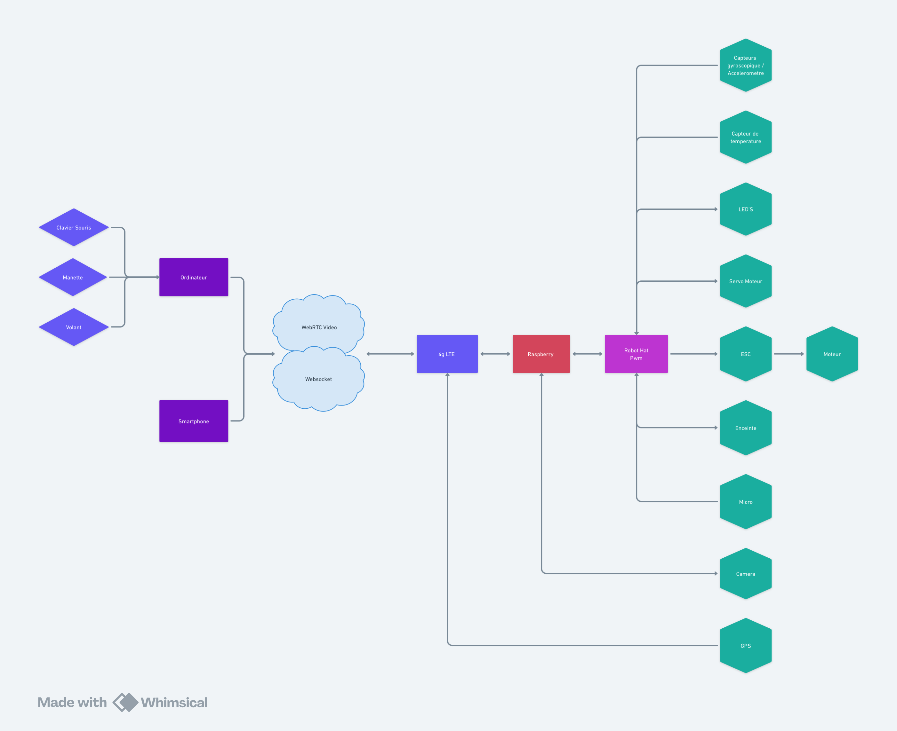

# Car Stream Project

**This code is Work In Progress** 

**All keys are visible to make an easy development**

## Context

The Project is to drive a RC Car from a Mobile Device or a computer. 

I use a raspberry pi on the car to control it without the original radio controller. I want to have some sensor to have feedback to the control device, like the computer to send haptics feedback, for exemple to the steering wheel or DOF cockpit.

## stream_livekit

To stream the video form the car I use WebRTC. To do that I use LiveKit solution.

This code is a backend client for livekit.

## References

https://livekit.io/